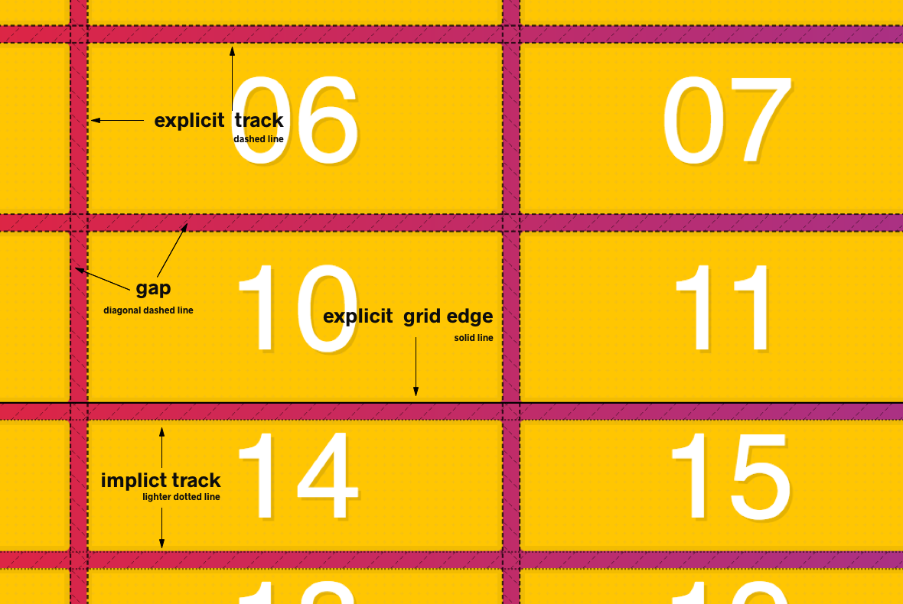

# CSS Grid Video Course

Hey! These are the starter files and finished solutions. Grab the full course over at [CSSGrid.io](https://CSSGrid.io).

## Course FAQ

### Q: I'm getting "This is meant to be run from within npm script."

Not sure why this is happening, but try these commands instead:

**windows:** `npm run start:win32`

**mac and linux:** `start:darwin:linux`

Very few people get this, but please contact me if you find out why `npm start` command isn't running.

### Q: I'm getting Browsersync Couldn't open browser (if you are using BrowserSync in a headless environment, you might want to set the open option to false)

This is because some versions of Firefox are "FirefoxDeveloperEdition" and some new downloads are "Firefox Developer Edition". If you had downloaded the browser before the course, just remove the spaces from the package.json command so it says "FirefoxDeveloperEdition"

### Q: I can't see the lines / numbers of Firefox' CSS Grid Inspection Tools

Make sure to turn off both "Use recommended performance settings" & "Use hardware acceleration when available“ within Preferences > Performance

## Community CSS Grid Content

Feel free to submit a PR adding a link to your own recaps, guides or reviews!

- [Course Review](https://www.bencodezen.io/blog/review-css-grid-with-wes-bos/) by [@bencodezen](https://www.twitter.com/bencodezen)
- [Recap and lessons learned](https://marcokuehbauch.com/blog/learning-css-grid/) by [@mkuehb](https://twitter.com/Mkuehb)
- [cssgrid.io course review](https://krzysztofzuraw.com/blog/2020/css-grid-io-course) by [@krzysztof_zuraw](https://twitter.com/krzysztof_zuraw)
- My [gh-page](https://herminiotorres.github.io/cssgrid) by [@herminiotorres](https://twitter.com/herminiotorres)

## A note on Pull Requests

These are meant to be 1:1 copies of what is done in the video. If you found a better / different way to do things, great, but I will be keeping them the same as the videos.

The starter files + solutions will be updated if/when the videos are updated.

Thanks!

## Live editable examples

I recommend you use the files in the repo, but if you prefer to use JSFiddle instead, here are all the starter files ready to go:

2.  [Starter Files and Tooling Setup](https://jsfiddle.net/6qvwur9q/)
3.  [CSS Grid Fundamentals](https://jsfiddle.net/qxxpgg4j/)
4.  [CSS Grid Dev Tools](https://jsfiddle.net/b55x8vh2/)
5.  [CSS Grid Implicit vs Explicit Tracks](https://jsfiddle.net/mon8xdgb/)
6.  [CSS grid-auto-flow Explained](https://jsfiddle.net/Loq4uj16/)
7.  [Sizing tracks in CSS Grid](https://jsfiddle.net/q8h3r8yb/)
8.  [CSS Grid repeat function](https://jsfiddle.net/8f8xyx86/)
9.  [Sizing Grid Items](https://jsfiddle.net/wqs6tcuk/)
10. [Placing Grid Items](https://jsfiddle.net/hs5xhvpp/)
11. [Spanning and Placing Cardio](https://jsfiddle.net/2z7z6o9k/)
12. [auto-fit and auto-fill](https://jsfiddle.net/d1pLngzx/)
13. [Using minmax() for Responsive Grids](https://jsfiddle.net/xthszm2j/)
14. Grid Template Areas:
    - [Area Line Names](https://jsfiddle.net/tkyxomht/)
    - [Areas](https://jsfiddle.net/p0sn7L7v/)
15. [Naming Lines in CSS Grid](https://jsfiddle.net/ygpmn0xh/)
16. [grid-auto-flow dense Block Fitting](https://jsfiddle.net/sxj83p70/)
17. [CSS Grid Alignment + Centering](https://jsfiddle.net/eyL9a2gv/)
18. [Re-ordering Grid Items](https://jsfiddle.net/uscf9mk0/)
19. [Nesting Grid with Album Layouts](https://jsfiddle.net/yn7jak0y/)
20. [CSS Grid Image Gallery](https://jsfiddle.net/cbjzped2/)
21. Flexbox vs CSS Grid:
    - [Axis Flipping](https://jsfiddle.net/pt8hym9s/)
    - [Controls on Right](https://jsfiddle.net/4o7gavuj/)
    - [Flex on Item](https://jsfiddle.net/1u264ftd/)
    - [Perfectly Centered](https://jsfiddle.net/sgbrtrjo/)
    - [Self Control](https://jsfiddle.net/c6gg8pkn/)
    - [Stacked Layout](https://jsfiddle.net/mnfm1sw0/)
    - [Unknown Content Size](https://jsfiddle.net/4ze02bkj/)
    - [Unknown Number of Items](https://jsfiddle.net/Lg7r3jmy/)
    - [Variable Widths on Each Row](https://jsfiddle.net/qymhootd/)
22. [Recreating Codepen](https://jsfiddle.net/br6n54qt/)
23. [Bootstrappy Grid with CSS Variables](https://jsfiddle.net/gLLht2hd/)
24. [Responsive Website](https://jsfiddle.net/bh16ofp8/)
25. [Full Bleed Blog Layout](https://jsfiddle.net/j8w6v3mh/)

## Notes

### Grid Template

```
grid-template-columns: 200px 500px 50px;
```

這段 CSS 意思是：

1. 排成 3 欄（因為有 3 個數字），如果排滿就塞下一行
2. 3 欄的寬度分別是：左`200px`，中`500px`，右`50px`

### `auto`

auto 意思是將外層寬度設定為 100%，減去已經定義好的欄寬，剩下的全部變成 auto 那欄的寬度

```
grid-template-columns: 200px auto 500px 50px;
```

比如螢幕寬度有`1000px`，減去已經使用的`200px`、`500px`與`50px`，剩下`250px`，那麼 4 欄的寬度分別為：

左 1`200px`，左 2`500px`，右 2`250px`、右 1`50px`

### `repeat()`

```
grid-template-columns: repeat(5, 100px);
```

repeat 的第一個參數是次數，第二個是寬度，所以這段等於這種寫法：

```
grid-template-columns: 100px 100px 100px 100px 100px;
```

意思是排成 5 欄，每欄的寬度分別為`100px`、`100px`、`100px`、`100px`、`100px`

### columns 跟 rows 的差異

```
grid-template-columns: 200px 500px 50px;
```

如果設定成這樣，grid 會排 3 欄，如果內容超過了 3 個，就會往下一列繼續排，但是第二列一樣會繼承`200px`、`500px`、`50px`這個寬度設定

```
grid-template-rows: 200px 500px 50px;
```

但是 rows 本來就是往下，所以沒有超過 3 個往下一欄這種，如果有 10 個內容，則只有前 3 個高度會分別為`200px`、`500px`、`50px`，第 4 個開始就是`height: auto`了

### Line Meanings



- solid line：Grid 整塊的邊界
- dashed line：explicit track，有明確指定 CSS
- dotted line：implicit track，沒有明確指定 CSS，由瀏覽器推算的

### Auto Rows

這個例題畫面中可以顯示一個 2 \* 2 的 grid 畫面，左上為 200px \* 50px，右上為 400px \* 50px，左下為 200px \* 100px，右下為 400px \* 100px

```html
<div class="container">
  <div class="item">1</div>
  <div class="item">2</div>
  <div class="item">3</div>
  <div class="item">4</div>
</div>
```

```css
.container {
  display: grid;
  grid-gap: 20px;
  grid-template-columns: 200px 400px;
  grid-template-rows: 50px 100px;
}
```

但是如果將 html 再新增 2 個 item 的話

```html
<div class="container">
  <div class="item">1</div>
  <div class="item">2</div>
  <div class="item">3</div>
  <div class="item">4</div>
  <div class="item">5</div>
  <div class="item">6</div>
</div>
```

由於沒有定義第三排的 rows，所以#5 跟#6 高度會是初始的 auto 高
而#5 與#6 也會等於 implicit track（CSS 沒有指定 grid，由瀏覽器自己推算）

我們可以透過指定`grid-auto-rows`，來定義例如#5、#6 這種沒有由 CSS 指定的元素的 row 高度

```diff css
.container {
  display: grid;
  grid-gap: 20px;
  grid-template-columns: 200px 400px;
  grid-template-rows: 50px 100px;
+ grid-auto-rows: 500px;
}
```

這樣一來，#5、#6 的高度就是 500px 了

### Auto flow

`grid-auto-flow`的預設值是`row`，所以這題可以看到畫面上#1 跟#2 是在第一列，#3 則是折下來變成第二列（位置在#1 下方）

```html
<div class="container">
  <div class="item">1</div>
  <div class="item">2</div>
  <div class="item">3</div>
</div>
```

```css
.container {
  display: grid;
  grid-gap: 20px;
  grid-template-columns: 400px 200px;
  grid-auto-flow: row;
}
```

如果將`grid-auto-flow`改成`column`，則#3 不會折下來，會往右排放在#2 的右邊

當 flow 為 column 時，我們一樣可以透過`grid-auto-columns`定義 implicit column 的寬度

```css
.container {
  display: grid;
  grid-gap: 20px;
  grid-template-columns: 400px 200px;
  grid-auto-flow: column;
  grid-auto-columns: 200px;
}
```

### Sizing 與 Tracks

在下面範例中，定義了 4 個 column，每個 column 寬度為 25%，並且也定義了 20px 的 gap，結果來說由於頁面寬度為 25% + 20px + 25% + 20px + 25% + 20px +25%，所以頁面會發生橫向捲軸（因為超過了 100%）

```html
<div class="container">
  <div class="item">1</div>
  <div class="item">2</div>
  <div class="item">3</div>
  <div class="item">4</div>
  <div class="item">5</div>
  <div class="item">6</div>
  <div class="item">7</div>
  <div class="item">8</div>
  <div class="item">9</div>
  <div class="item">10</div>
  <div class="item">11</div>
  <div class="item">12</div>
  <div class="item">13</div>
  <div class="item">14</div>
  <div class="item">15</div>
</div>
```

```css
.container {
  display: grid;
  grid-gap: 20px;
  grid-template-columns: 25% 25% 25% 25%;
}
```

因為單純使用百分比會有 gap 的問題，所以要換成另一個單位使用：`fr`，fractional unit 表示「剩下的空間」

以這題來說，假如整個 grid 的寬是 1000px，減去框線的 20px 後、再減去 gap 的 60px、減去前兩個 column 共減 400px，剩下的 520px 就是第三個 column 的寬度

```css
.container {
  display: grid;
  grid-gap: 20px;
  border: 10px solid var(--yellow);
  grid-template-columns: 200px 200px 1fr;
}
```

所以前面均等排 4 欄正確做法是這樣：

```diff css
.container {
  display: grid;
  grid-gap: 20px;
- grid-template-columns: 25% 25% 25% 25%;
+ grid-template-columns: 1fr 1fr 1fr 1fr;
}
```

注意 fr 對於 columns 的排版有立即效果，但是對於 rows 的排版沒有立即效果，比方說這段程式，有沒有加上最後的`grid-template-rows: 1fr 1fr 1fr 1fr`不會對外觀有任何影響，每個 item 的高度不會變化

```css
.container {
  display: grid;
  grid-gap: 20px;
  border: 10px solid var(--yellow);
  grid-template-columns: 1fr 1fr 1fr 1fr;
  grid-template-rows: 1fr 1fr 1fr 1fr;
}
```

因為.container 預設的 height 是 auto，所以對 auto 再去計算 fr 沒有意義，fr 算出來一樣是 auto，因此，需要再加上定義好的 height，才能讓 grid-template-rows 發揮作用

```diff css
.container {
  display: grid;
  grid-gap: 20px;
  border: 10px solid var(--yellow);
  grid-template-columns: 1fr 1fr 1fr 1fr;
  grid-template-rows: 1fr 1fr 1fr 1fr;
+ height: 600px;
}
```

除了`%`、`fr`以外，還有一個單位是`auto`，`auto`在很多時候跟`1fr`沒什麼差異，但是在這個範例，可以看到第一個 column 的寬度幾乎等於 item 裡面數字的寬度，第二個 column 的寬度則是被撐滿整頁，`auto`會比`fr`更優先參考 item 的內容寬度

```css
.container {
  display: grid;
  grid-gap: 20px;
  border: 10px solid var(--yellow);
  grid-template-columns: auto 1fr;
}
```

而在下面這個範例中，可以看到第一個 column 寬度是跟數字一樣窄、第二個 column 比較寬、第三個 column 寬度等於「Wes Bos Is Cool」、第四個 column 寬度跟第二個一樣

```html
<div class="container">
  <div class="item">1</div>
  <div class="item">2</div>
  <div class="item">Wes Bos Is Cool</div>
  <div class="item">4</div>
  <div class="item">5</div>
  <div class="item">6</div>
  <div class="item">7</div>
  <div class="item">8</div>
  <div class="item">9</div>
  <div class="item">10</div>
  <div class="item">11</div>
  <div class="item">12</div>
  <div class="item">13</div>
  <div class="item">14</div>
  <div class="item">15</div>
</div>
```

```css
.container {
  display: grid;
  grid-gap: 20px;
  border: 10px solid var(--yellow);
  grid-template-columns: auto 1fr auto 1fr;
}
```

我們也可以善用 fr 與 repeat，簡化程式

```
grid-template-columns: repeat(4, 1fr);
```

上面這段等於

```
grid-template-columns: 1fr 1fr 1fr 1fr;
```

repeat 的第二個參數也可以填不只一組單位：

```
grid-template-columns: repeat(4, 1fr 2fr);
```

等於：

```
grid-template-columns: 1fr 2fr 1fr 2fr 1fr 2fr 1fr 2fr;
```

也可以跟一般的單位組合

```
grid-template-columns: 100px repeat(4, 1fr auto) 200px repeat(2, 5fr);
```

### Grid Item Sizing

在以下這個案例中，畫面會被排成 5 個 column，當中第 4 個 column 會特別長，剩下其他 column 則是均等分

```html
<div class="container">
  <div class="item item">1</div>
  <div class="item item">2</div>
  <div class="item item">3</div>
  <div class="item item">4</div>
  <div class="item item">5</div>
  <div class="item item">6</div>
  <div class="item item">7</div>
  <div class="item item">8</div>
  <div class="item item">9</div>
  <div class="item item">10</div>
  <div class="item item">11</div>
  <div class="item item">12</div>
  <div class="item item">13</div>
  <div class="item item">14</div>
  <div class="item item">15</div>
  <div class="item item">16</div>
  <div class="item item">17</div>
  <div class="item item">18</div>
  <div class="item item">19</div>
  <div class="item item">20</div>
  <div class="item item">21</div>
  <div class="item item">22</div>
  <div class="item item">23</div>
  <div class="item item">24</div>
  <div class="item item">25</div>
  <div class="item item">26</div>
  <div class="item item">27</div>
  <div class="item item">28</div>
  <div class="item item">29</div>
  <div class="item item">30</div>
</div>
```

```css
.container {
  display: grid;
  grid-gap: 20px;
  grid-template-columns: repeat(5, 1fr);
}

.item9 {
  background: mistyrose;
  width: 500px;
}
```

因為`fr`是分配剩餘空間，所以 grid 會先計算減去有指定寬度的 item9 的 500px，再用剩下的寬度分配給其他 column

除了直接指定 item 寬度外，在 item9 裡面填滿很長的文字，讓他自然的寬度變長，也有相同效果

### Spanning

Grid 也有類似 colspan, rowspan 的方法，叫做 span

```css
.container {
  display: grid;
  grid-gap: 20px;
  grid-template-columns: repeat(5, 1fr);
}

.item9 {
  background: mistyrose;
  grid-column: span 2;
}
```

這樣 item9 的長度就會變成兩人份了（跨到原本 item10 的地方）

如果把 item9 的 span 設定成 3，則會發生：

```css
.item9 {
  background: mistyrose;
  grid-column: span 2;
}
```

item9 變成 3 倍寬度，原本所在的第二行擺不下，所以掉下去到第三行了，而第二行後面的位置就形成了空洞

span 也有另一種指定方法，track number 指定：

```html
<div class="container">
  <div class="item item1">1</div>
  <div class="item item2">2</div>
  <div class="item item3">3</div>
  <div class="item item4">4</div>
  <div class="item item5">5</div>
  <div class="item item6">6</div>
  <div class="item item7">7</div>
  <div class="item item8">8</div>
  <div class="item poop">💩</div>
  <div class="item item9">9</div>
  <div class="item item10">10</div>
  <div class="item item11">11</div>
  <div class="item item12">12</div>
  <div class="item item13">13</div>
  <div class="item item14">14</div>
  <div class="item item15">15</div>
  <div class="item item16">16</div>
  <div class="item item17">17</div>
  <div class="item item18">18</div>
  <div class="item item19">19</div>
  <div class="item item20">20</div>
  <div class="item item21">21</div>
  <div class="item item22">22</div>
  <div class="item item23">23</div>
  <div class="item item24">24</div>
  <div class="item item25">25</div>
  <div class="item item26">26</div>
  <div class="item item27">27</div>
  <div class="item item28">28</div>
  <div class="item item29">29</div>
  <div class="item item30">30</div>
</div>
```

```css
.container {
  display: grid;
  grid-gap: 20px;
  grid-template-columns: repeat(5, 1fr);
}

.poop {
  background: #bada55;
  grid-column-start: 2;
  grid-column-end: 5;
}
```

這種指定法除了指定 span 範圍以外，也可以設定擺放的初始位址，並且

```
grid-column-start: 2;
grid-column-end: 5;
```

能夠簡寫為

```
grid-column: 2 / 5;
```

`數字 / 數字`的寫法，第一個數字表示`start`，第二個數字表示`end`

也有另一種簡寫法

```
grid-column: span 2 / 5;
```

這個寫法中只有指定延展數量`2`，以及終始點`5`，但是這樣就可以推算起點等於 `5 - 2 = 3`，因此效果等同於：

```
grid-column: 3 / 5;
```

也有一種記法：`-1`，表示最後一欄，例如這個 grid 總共有 5 個 column，那麼

```
grid-column: 1 / -1;
```

即表示

```
grid-column: 1 / 5;
```

負數得計算方式是：

```
column總數量  + 1 + 負數項 = 結果
```

例如`-1` 為：`5 + 1 - 1 = 5`，所以他的 track number 為`5`

而`-2`則為：`5 + 1 - 2 = 4`，track number 為`4`

### Auto Fill 與 Auto Fit

在這個範例中，我們可以看到 grid 排成了 5 個 column，每個 column 的寬度是 150px，但是因為 150px \* 5 沒辦法完全利用到整個網頁的寬度，所以 grid 的右方出現了大空白

```html
<div class="container">
  <div class="item item1">Item 01</div>
  <div class="item item2">Item 02</div>
  <div class="item item3">Item 03</div>
  <div class="item item4">Item 04</div>
  <div class="item item5">Item 05</div>
  <div class="item item6">Item 06</div>
  <div class="item item7">Item 07</div>
  <div class="item item8">Item 08</div>
  <div class="item item9">Item 09</div>
  <div class="item item10">Item 10</div>
  <div class="item item11">Item 11</div>
  <div class="item item12">Item 12</div>
  <div class="item item13">Item 13</div>
  <div class="item item14">Item 14</div>
  <div class="item item15">Item 15</div>
  <div class="item item16">Item 16</div>
  <div class="item item17">Item 17</div>
  <div class="item item18">Item 18</div>
  <div class="item item19">Item 19</div>
  <div class="item item20">Item 20</div>
</div>
```

```css
.container {
  display: grid;
  grid-gap: 20px;
  border: 10px solid var(--yellow);
  grid-template-columns: repeat(5, 150px);
}
```

將 repeat 的數量改為 auto-fill

```diff css
.container {
  display: grid;
  grid-gap: 20px;
  border: 10px solid var(--yellow);
- grid-template-columns: repeat(5, 150px);
+ grid-template-columns: repeat(auto-fill, 150px);
}
```

這表示說，我們只定義每個 column 的寬度須為 150px，但是看網頁有多寬，就塞幾個 column，等於 column 的數量是隨網頁大小而定

`auto-fil`與`auto-fill`幾乎是一樣，但是有一個差異，這個差異要用 FireFox 的 Grid debug 才看得出來：

```html
<div class="container">
  <div class="item item1">Item 01</div>
  <div class="item item2">Item 02</div>
  <div class="item item3">Item 03</div>
  <div class="item item4">Item 04</div>
</div>
```

```css
.container {
  display: grid;
  grid-gap: 20px;
  border: 10px solid var(--yellow);
  grid-template-columns: repeat(auto-fill, 150px);
}
```

在 auto-fill 中，我們可以看到整個 grid 的 explicit line 的 end 是在網頁的最右方，比如網頁寬度有 1000px，item 排滿了 4 個 column，還剩下 2 個 column 的空間，grid 會把 column5 跟 column6 也畫出來，然後 explicit line 會在 column6 的右方

```css
.container {
  display: grid;
  grid-gap: 20px;
  border: 10px solid var(--yellow);
  grid-template-columns: repeat(auto-fit, 150px);
}
```

但是如果換成 auto-fit 的話，grid 不會將沒利用到的 column5 跟 column6 給畫出來，而 explicit line 會在實際使用到的，也就是第 4 個 column 的右方

所以如果我們今天針對.item4 給特殊定位：

```css
.container {
  display: grid;
  grid-gap: 20px;
  border: 10px solid var(--yellow);
  grid-template-columns: repeat(auto-fill, 150px);
}

.item4 {
  grid-column: auto / -1;
}
```

在 auto-fill 的場合，可以看到類似這樣的畫面：

```
|item 1| |item 2| |item 3|             |item 4|
```

```css
.container {
  display: grid;
  grid-gap: 20px;
  border: 10px solid var(--yellow);
  grid-template-columns: repeat(auto-fit, 150px);
}

.item4 {
  grid-column: auto / -1;
}
```

但是在 auto-fit，則會看到這樣：

```
|item 1| |item 2| |item 3| |item 4|
```

### minmax

在這個案例中，可以看到有 4 個 column，每個各 100px，導致右邊有很大空白，如果把螢幕換成手機尺寸，則每個 column 都會折到下一列，而右邊一樣會很多空白

```html
<div class="container">
  <div class="item item1">Item 01</div>
  <div class="item item2">Bonjour!</div>
  <div class="item item3">Item 03</div>
  <div class="item item4">Item 04</div>
</div>
```

```css
.container {
  display: grid;
  grid-gap: 20px;
  border: 10px solid var(--yellow);
  grid-template-columns: repeat(auto-fill, 100px);
}
```

我們希望讓他有基本的 RWD 效果，讓每個 column 在手機版可以滿版，我們可以使用`minmax()`，`minmax()`的第一個參數是最小值，第二個參數是最大值

這個案例中，因為 repeat 的數量是定義為`auto-fill`，他會假設後面還有 item5、item6，當 grid 沒有發生 column overflow 時（在大螢幕時），column 寬度會採最小值的 100px，但是當發生了 overflow 時（在手機螢幕，column 掉下來成為第二行），這時就會採用 max 的 1fr

```diff css
.container {
  display: grid;
  grid-gap: 20px;
  border: 10px solid var(--yellow);
- grid-template-columns: repeat(auto-fill, 100px);
+ grid-template-columns: repeat(auto-fill, minmax(100px, 1fr));
}
```

但是這個案例，repeat 的數量改採用了`auto-fit`，則不管螢幕多大，都會優先填滿整個寬度的`1fr`，所以會鋪滿

```css
.container {
  display: grid;
  grid-gap: 20px;
  border: 10px solid var(--yellow);
  grid-template-columns: repeat(auto-fit, minmax(100px, 1fr));
}
```

接下來在看另一個案例，處理長文字的 item，這個案例有 4 個 column，各 100px，可以看到第二個 item 因為內文比較多，所以文字超出 item 範圍了

```css
.container {
  display: grid;
  grid-gap: 20px;
  border: 10px solid var(--yellow);
  grid-template-columns: 100px 100px 100px 100px;
}
```

如果將第二個 column 改為`auto`，則第二個 column 會填滿空白的寬度，成為最寬的一個 column

```
grid-template-columns: 100px auto 100px 100px;
```

我們解決了長文字破版的問題，但是第二個好像變太長了

所以改成這樣，第二個 item（Bonjour!）的寬度剛好等於文字寬，當指定`fit-content(100px)`時，如果 item 內容量很少，那 item 的寬度會等於`100px`，但如果 item 內容很長，那他會看 item 需要多少空間來決定它的大小

```
grid-template-columns: 100px fit-content(100px) 100px 100px;
```

### Area Name

這個案例中會畫出一個 3\*3 的 grid，當中填了 4 個 item，剩下 5 個位置是空的

```html
<div class="container">
  <div class="item item1">
    <p>I'm Sidebar #1</p>
  </div>
  <div class="item item2">
    <p>
      Lorem ipsum dolor sit amet consectetur adipisicing elit. Inventore, sed.
    </p>
    <p>Lorem ipsum d</p>
  </div>
  <div class="item item3">
    <p>I'm Sidebar #2</p>
  </div>
  <div class="item footer">
    <p>I'm the footer</p>
  </div>
</div>
```

```css
.container {
  display: grid;
  grid-gap: 20px;
  grid-template-columns: 1fr 500px 1fr;
  grid-template-rows: 150px 150px 100px;
}
```

我們可以給 9 個位置各自的命名

```css
.container {
  display: grid;
  grid-gap: 20px;
  grid-template-columns: 1fr 500px 1fr;
  grid-template-rows: 150px 150px 100px;
  grid-template-areas:
    "sidebar-1 content sidebar-2"
    "sidebar-1 content sidebar-2"
    "footer footer footer";
}
```

然後在 Debug 選項中把「Diaply area names」打開，就能在瀏覽器上看到名稱了

如果想要跳過一些不要命名，可以用`.`

```
grid-template-areas:
    "sidebar-1 content sidebar-2"
    "sidebar-1 content sidebar-2"
    "footer footer .";
```

回到 html，我們想要讓第 4 個 item 成為 footer，貼滿整個底部，利用剛剛命名好的 area 名稱，在下`grid-area: footer`，就可以做到了

```css
.container {
  display: grid;
  grid-gap: 20px;
  grid-template-columns: 1fr 500px 1fr;
  grid-template-rows: 150px 150px 100px;
  grid-template-areas:
    "sidebar-1 content sidebar-2"
    "sidebar-1 content sidebar-2"
    "footer  footer  footer";
}

.footer {
  grid-area: footer;
}
```

name 也可以用來指定 line 的位置，這題總共排了 8 欄，前 4 欄是 💩，後 4 欄是 🍔

```html
<div class="container">
  <div class="item item1">1</div>
  <div class="item item2">2</div>
  <div class="item item3">3</div>
  <div class="item item4">4</div>
  <div class="item item5">5</div>
  <div class="item item6">6</div>
  <div class="item item7">7</div>
  <div class="item item8">8</div>
  <div class="item item9">9</div>
  <div class="item item10">10</div>
  <div class="item item11">11</div>
  <div class="item item12">12</div>
  <div class="item item13">13</div>
  <div class="item item14">14</div>
  <div class="item item15">15</div>
  <div class="item item16">16</div>
  <div class="item item17">17</div>
  <div class="item item18">18</div>
  <div class="item item19">19</div>
  <div class="item item20">20</div>
  <div class="item item21">21</div>
  <div class="item item22">22</div>
  <div class="item item23">23</div>
  <div class="item item24">24</div>
  <div class="item item25">25</div>
  <div class="item item26">26</div>
  <div class="item item27">27</div>
  <div class="item item28">28</div>
  <div class="item item29">29</div>
  <div class="item item30">30</div>
</div>
```

```css
.container {
  display: grid;
  grid-gap: 20px;
  grid-template-areas:
    "💩 💩 💩 💩 🍔 🍔 🍔 🍔"
    "💩 💩 💩 💩 🍔 🍔 🍔 🍔"
    "💩 💩 💩 💩 🍔 🍔 🍔 🍔"
    "💩 💩 💩 💩 🍔 🍔 🍔 🍔";
}
```

針對.item3 指定說起始點是 💩 的開始位置，也就是 1，終點是 💩 的結束位置，也就是 4

```css
.item3 {
  grid-column: 💩-start / 💩-end;
}
```

效力等於：

```css
.item3 {
  grid-column: 1 / 5;
}
```

### Line Name

先看一個沒有 line naming 的範例

```html
<div class="container">
  <div class="item item1">1</div>
  <div class="item item2">2</div>
  <div class="item item3">3</div>
  <div class="item item4">4</div>
  <div class="item item5">5</div>
  <div class="item item6">6</div>
  <div class="item item7">7</div>
  <div class="item item8">8</div>
  <div class="item item9">9</div>
  <div class="item item10">10</div>
  <div class="item item11">11</div>
  <div class="item item12">12</div>
  <div class="item item13">13</div>
  <div class="item item14">14</div>
  <div class="item item15">15</div>
  <div class="item item16">16</div>
  <div class="item item17">17</div>
  <div class="item item18">18</div>
  <div class="item item19">19</div>
  <div class="item item20">20</div>
  <div class="item item21">21</div>
  <div class="item item22">22</div>
  <div class="item item23">23</div>
  <div class="item item24">24</div>
  <div class="item item25">25</div>
  <div class="item item26">26</div>
  <div class="item item27">27</div>
  <div class="item item28">28</div>
  <div class="item item29">29</div>
  <div class="item item30">30</div>
</div>
```

```css
.container {
  display: grid;
  grid-gap: 20px;
  grid-template-columns: 1fr 500px 1fr;
  grid-template-rows: repeat(10, auto);
}

.item3 {
  background: slateblue;
  grid-column: 2;
  grid-row: 1 / span 10;
}
```

定義 line name 的方式是使用中括號

```diff css
.container {
  display: grid;
  grid-gap: 20px;
- grid-template-columns: 1fr 500px 1fr;
+ grid-template-columns: [side-left] 1fr [content-start] 500px [content-end] 1fr [side-right];
- grid-template-rows: repeat(10, auto);
+ grid-template-rows: [content-top] repeat(10, auto) [content-bottom];
}

.item3 {
  background: slateblue;
- grid-column: 2;
+ grid-column: content-start;
- grid-row: 1 / span 10;
+ grid-row: content-top / content-bottom;
}
```

也可以對同一個 line 設定兩個以上的名稱：

```
grid-template-columns: [sidebar-start side-left] 1fr [sidebar-end content-start] 500px [content-end] 1fr [side-right]
```

### Dense Flow

```html
<div class="container">
  <div class="item item1">1</div>
  <div class="item item2">2</div>
  <div class="item item3">3</div>
  <div class="item item4">4</div>
  <div class="item item5">5</div>
  <div class="item item6">6</div>
  <div class="item item7">7</div>
  <div class="item item8">8</div>
  <div class="item item9">9</div>
  <div class="item item10">10</div>
  <div class="item item11">11</div>
  <div class="item item12">12</div>
  <div class="item item13">13</div>
  <div class="item item14">14</div>
  <div class="item item15">15</div>
  <div class="item item16">16</div>
  <div class="item item17">17</div>
  <div class="item item18">18</div>
  <div class="item item19">19</div>
  <div class="item item20">20</div>
  <div class="item item21">21</div>
  <div class="item item22">22</div>
  <div class="item item23">23</div>
  <div class="item item24">24</div>
  <div class="item item25">25</div>
  <div class="item item26">26</div>
  <div class="item item27">27</div>
  <div class="item item28">28</div>
  <div class="item item29">29</div>
  <div class="item item30">30</div>
  <div class="item item31">31</div>
  <div class="item item32">32</div>
  <div class="item item33">33</div>
  <div class="item item34">34</div>
  <div class="item item35">35</div>
  <div class="item item36">36</div>
  <div class="item item37">37</div>
  <div class="item item38">38</div>
  <div class="item item39">39</div>
  <div class="item item40">40</div>
  <div class="item item41">41</div>
  <div class="item item42">42</div>
  <div class="item item43">43</div>
  <div class="item item44">44</div>
  <div class="item item45">45</div>
  <div class="item item46">46</div>
  <div class="item item47">47</div>
  <div class="item item48">48</div>
  <div class="item item49">49</div>
  <div class="item item50">50</div>
  <div class="item item51">51</div>
  <div class="item item52">52</div>
  <div class="item item53">53</div>
  <div class="item item54">54</div>
  <div class="item item55">55</div>
  <div class="item item56">56</div>
  <div class="item item57">57</div>
  <div class="item item58">58</div>
  <div class="item item59">59</div>
  <div class="item item60">60</div>
  <div class="item item61">61</div>
  <div class="item item62">62</div>
  <div class="item item63">63</div>
  <div class="item item64">64</div>
  <div class="item item65">65</div>
  <div class="item item66">66</div>
  <div class="item item67">67</div>
  <div class="item item68">68</div>
  <div class="item item69">69</div>
  <div class="item item70">70</div>
</div>
```

```css
.container {
  display: grid;
  grid-gap: 20px;
  grid-template-columns: repeat(10, 1fr);
}

.item:nth-child(6n) {
  background: cornflowerblue;
  grid-column: span 6;
}
```

上面這個案例中可以看到畫面中存在不少空缺，我們想要讓這些空缺清掉，可以使用 dense，但是他會打亂既有的 item 順序

```diff css
.container {
  display: grid;
  grid-gap: 20px;
  grid-template-columns: repeat(10, 1fr);
+ grid-auto-flow: dense;
}
```

### justify-items 與 align-items

```html
<div class="container">
  <div class="itm itm1">1</div>
  <div class="itm itm2">2</div>
  <div class="itm itm3">3</div>
  <div class="itm itm4">4</div>
  <div class="itm itm5">5</div>
  <div class="itm itm6">6</div>
  <div class="itm itm7">7</div>
  <div class="itm itm8">8</div>
  <div class="itm itm9">9</div>
  <div class="itm itm10">10</div>
  <div class="itm itm11">11</div>
  <div class="itm itm12">12</div>
  <div class="itm itm13">13</div>
  <div class="itm itm14">14</div>
  <div class="itm itm15">15</div>
  <div class="itm itm16">16</div>
  <div class="itm itm17">17</div>
  <div class="itm itm18">18</div>
  <div class="itm itm19">19</div>
  <div class="itm itm20">20</div>
  <div class="itm itm21">21</div>
  <div class="itm itm22">22</div>
  <div class="itm itm23">23</div>
  <div class="itm itm24">24</div>
  <div class="itm itm25">25</div>
  <div class="itm itm26">26</div>
  <div class="itm itm27">27</div>
  <div class="itm itm28">28</div>
  <div class="itm itm29">29</div>
  <div class="itm itm30">30</div>
  <div class="itm itm31">31</div>
  <div class="itm itm32">32</div>
  <div class="itm itm33">33</div>
  <div class="itm itm34">34</div>
  <div class="itm itm35">35</div>
  <div class="itm itm36">36</div>
  <div class="itm itm37">37</div>
  <div class="itm itm38">38</div>
  <div class="itm itm39">39</div>
  <div class="itm itm40">40</div>
</div>
```

```css
.container {
  display: grid;
  grid-gap: 20px;
  grid-template-columns: repeat(10, 1fr);
}

.itm {
  background: #fff;
}
```

這個範例中可以看到一排有 10 欄 item，一排當中扣除掉 gap 的空間，每個 item 都是填滿他的格子，而內文的數字位於白色 item 的左方

```diff css
.container {
  display: grid;
  grid-gap: 20px;
  grid-template-columns: repeat(10, 1fr);
+ justify-items: center;
}

.itm {
  background: #fff;
}
```

加上`justify-items: center;`之後，可以看到原本 item 都是盡可能填滿他那格，變成 item 寬度只涵蓋住內文的部分，乍看之下會覺得彼此之間空隙很大，並且數字會在 cell 的中間

`justify-items`屬性預設是`justify-items: stretch;`，也就是一開始看到的填滿樣式

`justify-items`屬性還有`start`、`end`、`stretch`、`center`、`flex-start`、`flex-end`

`justify-items`用來處理水平的對齊，垂直的對齊會用`align-items`

alignment 還可以使用簡寫：`place-items`，第一個值代表`align-items`、第二個值代表`justify-items`

```
place-items: center start;
```

這行等同於：

```
align-items: center;
justify-items: start;
```

### justify-content 與 align-content

延續上個範例的 html，換下面這個 css 套上，可以看到畫面中有 5 個 column，每個 column 各為 100px，沒法填滿整面螢幕，所以右方會有一大塊空白

```css
.container {
  display: grid;
  grid-gap: 20px;
  grid-template-columns: repeat(5, 100px);
  grid-template-rows: repeat(5, 100px);
}

.itm {
  background: #fff;
}
```

在.container 添加`justify-content`屬性

```diff css
.container {
  display: grid;
  grid-gap: 20px;
  grid-template-columns: repeat(5, 100px);
  grid-template-rows: repeat(5, 100px);
+ justify-content: center;
}

.itm {
  background: #fff;
}
```

可以看到整坨 grid 都置中了

`justify-content`可以填`center`、`space-around`（會留左右邊界）、`space-between`（不留左右邊界）

`justify-content`的使用發生在 grid-template 定義成死的 px，如果是定義成活的 fr 或是%不太會用到 alignment

同樣也有 for 垂直的`align-content`，但是需要搭配固定 height 使用

```css
.container {
  display: grid;
  grid-gap: 20px;
  grid-template-columns: repeat(5, 100px);
  height: 500px;
  justify-content: space-between;
  align-content: space-between;
}
```

### Order

在這個範例中可以看到左上排了短短的 logo，右上排了長長的 nav，下方排了一整排的 content

```html
<div class="container">
  <div class="item logo">LOGO</div>
  <div class="item nav">NAV</div>
  <div class="item content">
    <p>I'm the Content!</p>
  </div>
</div>
```

```css
.container {
  display: grid;
  grid-gap: 20px;
  grid-template-columns: repeat(10, 1fr);
}

.logo {
  grid-column: span 2;
}

.nav {
  grid-column: span 8;
}

.content {
  grid-column: 1 / -1;
}
```

`order`的預設值是`0`，如果數字越大，他就會越接近邊界，例如 column 的右邊，row 的下面

將範例改成這樣，長長的 nav 會在左上方，右上角會有短短的 logo，下方還是一條 content

```css
.container {
  display: grid;
  grid-gap: 20px;
  grid-template-columns: repeat(10, 1fr);
}

.logo {
  grid-column: span 2;
  order: 2;
}

.nav {
  grid-column: span 8;
  order: 1;
}

.content {
  grid-column: 1 / -1;
  order: 3;
}
```

### Grid Template 的簡寫

```
grid-template-columns: 1fr 1fr;
grid-template-rows: 1fr 1fr;
```

可以簡寫為：

```
grid-template: 1fr 1fr / 1fr 1fr;
```

### 實作：格線系統

先看以下的案例，我們透過 grid 的設定，畫出一個 12 欄的格線系統

```html
<div class="grid">
  <div class="item">1</div>
  <div class="item">2</div>
  <div class="item">3</div>
  <div class="item">4</div>
</div>
```

```css
.grid {
  display: grid;
  grid-template-columns: repeat(12, 1fr);
  grid-gap: 20px;
}
```

但是，卻發現如果將其中一個 html 的內容文字放比較長，格線系統就會變得沒有每個都等寬

```diff html
<div class="grid">
  <div class="item">1</div>
  <div class="item">2</div>
+ <div class="item">Wesbos</div>
  <div class="item">3</div>
  <div class="item">4</div>
</div>
```

針對這個現象，可以透過設定子項目`min-width: 0`來解決

```diff css
.grid {
  display: grid;
  grid-template-columns: repeat(12, 1fr);
  grid-gap: 20px;
}

+.item {
+  min-width: 0;
+}
```

或也可以透過更詳細的寬度設定來解：

```diff css
.grid {
  display: grid;
- grid-template-columns: repeat(12, 1fr);
+ grid-template-columns: repeat(12, calc(8.33% - 20px));
  grid-gap: 20px;
}
```

但是最好的解法，是使用`minmax()`，並且讓子項目加上`width: 100%`

```diff css
.grid {
  display: grid;
+ grid-template-columns: repeat(12, minmax(0, 1fr));
  grid-gap: 20px;
}

+.item {
+  min-width: 0;
+  width: 100%;
+}
```
